# terraform-azure-automanage-ai

Azure Automanage module with AI-driven infrastructure optimization, automated patching, backup management, compliance enforcement, and intelligent alerting. This module provisions a complete VM management platform with self-healing capabilities and centralized monitoring.

## Architecture

```mermaid
graph TB
    subgraph Automanage["Azure Automanage"]
        style Automanage fill:#0078d4,stroke:#004578,color:#ffffff
        Config["Automanage Configuration"]
        Antimalware["Antimalware"]
        AutoBackup["Automated Backup"]
    end

    subgraph Maintenance["Patch Management"]
        style Maintenance fill:#008272,stroke:#004d47,color:#ffffff
        MaintConfig["Maintenance Configuration"]
        MaintWindow["Maintenance Window"]
        PatchLinux["Linux Patches"]
        PatchWindows["Windows Patches"]
    end

    subgraph Backup["Backup & Recovery"]
        style Backup fill:#5c2d91,stroke:#3b1f6e,color:#ffffff
        Vault["Recovery Services Vault"]
        BackupPolicy["Backup Policy"]
        ProtectedVMs["Protected VMs"]
    end

    subgraph Compliance["Policy & Compliance"]
        style Compliance fill:#e81123,stroke:#a80000,color:#ffffff
        PolicyDef["Policy Definitions"]
        PolicyAssign["Policy Assignments"]
        BuiltIn["Built-in Policies"]
    end

    subgraph Monitoring["Monitoring & Alerting"]
        style Monitoring fill:#ff8c00,stroke:#cc7000,color:#ffffff
        LogAnalytics["Log Analytics Workspace"]
        ActionGroup["Action Group"]
        CPUAlert["CPU Alert"]
        MemAlert["Memory Alert"]
        DiskAlert["Disk Alert"]
        AvailAlert["Availability Alert"]
    end

    subgraph Automation["Auto-Remediation"]
        style Automation fill:#107c10,stroke:#0b5e0b,color:#ffffff
        AutoAccount["Automation Account"]
        Runbooks["Runbooks"]
        Identity["Managed Identity"]
    end

    subgraph VMs["Virtual Machines"]
        style VMs fill:#505050,stroke:#333333,color:#ffffff
        VM1["VM 1"]
        VM2["VM 2"]
        VMn["VM n"]
    end

    Config --> VMs
    Antimalware --> VMs
    MaintConfig --> VMs
    MaintWindow --> MaintConfig
    PatchLinux --> MaintConfig
    PatchWindows --> MaintConfig
    Vault --> ProtectedVMs
    BackupPolicy --> ProtectedVMs
    ProtectedVMs --> VMs
    PolicyAssign --> VMs
    PolicyDef --> PolicyAssign
    BuiltIn --> PolicyAssign
    LogAnalytics --> Vault
    LogAnalytics --> AutoAccount
    ActionGroup --> CPUAlert
    ActionGroup --> MemAlert
    ActionGroup --> DiskAlert
    ActionGroup --> AvailAlert
    CPUAlert --> VMs
    MemAlert --> VMs
    DiskAlert --> VMs
    AvailAlert --> VMs
    AutoAccount --> Runbooks
    Identity --> AutoAccount
    Runbooks --> VMs
```



## Documentation

- [Azure Automanage Overview](https://learn.microsoft.com/en-us/azure/automanage/overview-about)
- [Azure Automation Overview](https://learn.microsoft.com/en-us/azure/automation/overview)
- [Terraform azurerm_automanage_configuration](https://registry.terraform.io/providers/hashicorp/azurerm/latest/docs/resources/automanage_configuration)
- [Azure Update Management](https://learn.microsoft.com/en-us/azure/automation/update-management/overview)
- [Azure Backup for VMs](https://learn.microsoft.com/en-us/azure/backup/backup-azure-vms-introduction)
- [Azure Policy Overview](https://learn.microsoft.com/en-us/azure/governance/policy/overview)

## Prerequisites

- Terraform >= 1.5.0
- AzureRM Provider >= 3.90.0
- An existing Azure Resource Group
- One or more Azure Virtual Machine resource IDs
- Azure CLI authenticated with sufficient permissions (Contributor + User Access Administrator on the resource group)
- The `Microsoft.Automanage`, `Microsoft.RecoveryServices`, `Microsoft.PolicyInsights`, and `Microsoft.Automation` resource providers registered on the subscription

## Deployment Guide

### Step 1: Register Required Resource Providers

```bash
az provider register --namespace Microsoft.Automanage
az provider register --namespace Microsoft.RecoveryServices
az provider register --namespace Microsoft.PolicyInsights
az provider register --namespace Microsoft.Automation
az provider register --namespace Microsoft.Maintenance
```

### Step 2: Configure Backend (Optional)

```hcl
terraform {
  backend "azurerm" {
    resource_group_name  = "tfstate-rg"
    storage_account_name = "tfstatestorage"
    container_name       = "tfstate"
    key                  = "automanage.tfstate"
  }
}
```

### Step 3: Create Variable Definitions

Create a `terraform.tfvars` file:

```hcl
name_prefix         = "prod-automanage"
location            = "eastus2"
resource_group_name = "production-rg"

vm_ids = [
  "/subscriptions/xxxx/resourceGroups/production-rg/providers/Microsoft.Compute/virtualMachines/web-vm-01",
  "/subscriptions/xxxx/resourceGroups/production-rg/providers/Microsoft.Compute/virtualMachines/app-vm-01"
]

maintenance_window = {
  day        = "Saturday"
  start_time = "03:00"
  duration   = "04:00"
}

backup_frequency      = "Daily"
backup_retention_days = 30
enable_antimalware    = true
enable_auto_patching  = true

alert_email_addresses = [
  "ops-team@company.com",
  "oncall@company.com"
]

log_retention_days = 90

tags = {
  Environment = "production"
  Team        = "infrastructure"
  ManagedBy   = "terraform"
}
```

### Step 4: Initialize and Apply

```bash
terraform init
terraform plan -out=tfplan
terraform apply tfplan
```

### Step 5: Verify Deployment

```bash
# Check Automanage configuration
az automanage configuration-profile list --resource-group production-rg

# Verify backup protection
az backup item list --resource-group production-rg --vault-name prod-automanage-recovery-vault

# Check policy compliance
az policy state list --resource-group production-rg --query "[].{Policy:policyDefinitionName, Compliance:complianceState}"
```

## Inputs

| Name | Description | Type | Default | Required |
|------|-------------|------|---------|----------|
| `name_prefix` | Prefix for all resource names | `string` | n/a | yes |
| `location` | Azure region for all resources | `string` | n/a | yes |
| `resource_group_name` | Name of the Azure resource group | `string` | n/a | yes |
| `vm_ids` | List of Virtual Machine resource IDs to manage | `list(string)` | n/a | yes |
| `maintenance_window` | Maintenance window configuration (day, start_time, duration) | `object` | Saturday 02:00, 5h | no |
| `backup_frequency` | Frequency of VM backups (Daily or Weekly) | `string` | `"Daily"` | no |
| `backup_retention_days` | Number of days to retain VM backups | `number` | `30` | no |
| `enable_antimalware` | Enable Microsoft Antimalware extension | `bool` | `true` | no |
| `enable_auto_patching` | Enable automatic OS patching | `bool` | `true` | no |
| `compliance_policies` | List of custom Azure Policy definitions | `list(object)` | `[]` | no |
| `alert_email_addresses` | Email addresses for alert notifications | `list(string)` | `[]` | no |
| `log_retention_days` | Days to retain logs in Log Analytics | `number` | `90` | no |
| `automation_runbooks` | Automation runbooks for auto-remediation | `list(object)` | VM restart runbook | no |
| `tags` | Tags to apply to all resources | `map(string)` | `{}` | no |

## Outputs

| Name | Description |
|------|-------------|
| `automanage_config_id` | The ID of the Automanage configuration profile |
| `maintenance_config_id` | The ID of the maintenance configuration |
| `recovery_vault_id` | The ID of the Recovery Services vault |
| `backup_policy_id` | The ID of the VM backup policy |
| `policy_assignment_ids` | Map of custom policy assignment names to their IDs |
| `action_group_id` | The ID of the monitor action group |
| `automation_account_id` | The ID of the automation account |
| `log_analytics_workspace_id` | The ID of the Log Analytics workspace |

## Usage Example

```hcl
module "automanage" {
  source = "github.com/kogunlowo123/terraform-azure-automanage-ai"

  name_prefix         = "myapp"
  location            = "westus2"
  resource_group_name = "myapp-rg"

  vm_ids = [
    azurerm_linux_virtual_machine.web.id,
    azurerm_windows_virtual_machine.app.id,
  ]

  maintenance_window = {
    day        = "Sunday"
    start_time = "04:00"
    duration   = "03:00"
  }

  backup_frequency      = "Daily"
  backup_retention_days = 60
  enable_antimalware    = true
  enable_auto_patching  = true

  alert_email_addresses = ["platform-team@example.com"]
  log_retention_days    = 120

  compliance_policies = [
    {
      name         = "require-tags"
      display_name = "Require Environment Tag"
      description  = "Ensures all VMs have an Environment tag"
      policy_rule  = jsonencode({
        if = {
          field  = "[concat('tags[', 'Environment', ']')]"
          exists = "false"
        }
        then = {
          effect = "deny"
        }
      })
    }
  ]

  tags = {
    Environment = "staging"
    Project     = "platform"
  }
}
```

## License

MIT License - see [LICENSE](LICENSE) for details.
